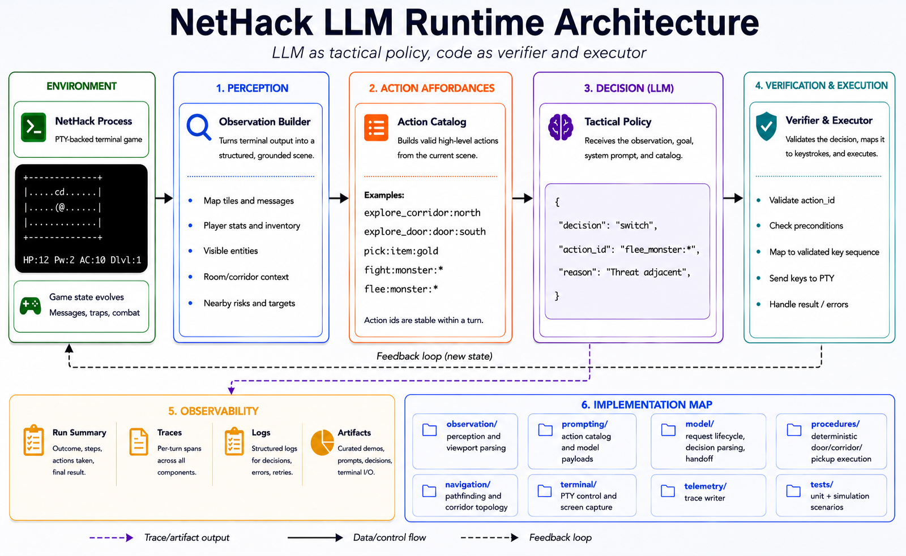

# Nethack Agent Boundary

A bounded LLM agent runtime using NetHack as an adversarial testbed.

This project studies how to make an LLM useful inside a narrow operational
envelope: structured observations, generated affordances, deterministic
execution, interruption rules, and auditable traces. NetHack is the environment,
not the product.

It is not a production NetHack bot and it does not claim to win games. The
engineering question is different:

> How do you bind model judgment to a runtime that constrains what the model can
> perceive, choose, execute, and audit?

Short version:

> LLM as tactical policy, code as verifier and executor.

## Core Thesis

LLMs should not be asked to drive a live terminal by inventing raw keystrokes.
The runtime should define the context boundary, expose grounded affordances,
validate model choices, execute mechanical chains, and hand control back only at
meaningful decision points.

In this project:

- The model sees a compact scene, not the raw terminal buffer as its only
  interface.
- The model chooses from generated high-level actions, not arbitrary controls.
- Code owns pathing, door retries, corridor following, item pickup mechanics,
  interruption checks, and trace logging.
- NetHack supplies a hostile, partially observable, stateful environment where
  weak runtime boundaries fail quickly.

## Architecture At A Glance



The runtime loop is intentionally narrow:

1. Observe the live terminal and build a structured visible scene.
2. Generate a catalog of valid affordances such as `pick:item:*`,
   `explore_corridor:*`, `explore_door:*`, `fight:*`, and `flee:*`.
3. Ask the model to choose a semantic intent with a `continue` / `switch`
   contract.
4. Validate the selected action against the current action catalog.
5. Execute deterministic procedures for repeated mechanics.
6. Stop and hand control back when the runtime reaches a tactical boundary:
   hostile pressure, room entrance, intersection, blockage, dead end, completed
   pickup, or safety limit.
7. Record enough trace data to audit whether the model or runtime made the bad
   decision.

This is the bounded-context contract: the model can make tactical choices, but
the runtime owns the envelope in which those choices are legal and executable.

## What This Demonstrates

- **Bounded action design:** the model is constrained to generated affordances
  grounded in the current observed scene.
- **Runtime-verified execution:** selected actions are validated and translated
  into low-level NetHack keys by code.
- **Procedure state:** high-level intents survive multiple observations while
  the runtime performs repeated movement, door, corridor, and pickup mechanics.
- **Interrupt handling:** procedures stop when hostiles appear, topology changes,
  movement blocks, a pickup completes, or a new tactical choice is needed.
- **Topology automation:** corridors and doors are handled by deterministic
  procedures instead of repeated model calls.
- **Trace observability:** model input, available actions, parsed decisions,
  runtime ownership, low-level inputs, outcomes, and cleanup state are recorded
  for debugging.

## Why NetHack

NetHack is useful here because it is old, hostile, partially observable, and unforgiving. A small terminal mistake can change the tactical situation. Pets
block paths. Doors, corridors, monsters, hidden threats, and noisy messages all
stress the model/runtime boundary.

That makes it a good testbed for constrained agent control. The goal is not
game mastery. The goal is to show how an LLM can be useful when a runtime limits
what it can do and takes responsibility for mechanical execution.

## Evidence

The project is intended to be reviewed as an architecture and implementation,
not as a perfect live gameplay demo.

- `234` unit tests cover observation, viewport parsing, pathfinding,
  prompt/action generation, decision parsing, procedure execution, traces,
  simulation scenarios, and TUI formatting.
- `11` deterministic simulation checks cover corridor ends, turns,
  intersections, room entrances, door entry, flee behavior, pet blocking, and
  hostile interruption during item pickup.
- [docs/demo/corridor_follow_trace.md](docs/demo/corridor_follow_trace.md)
  annotates a curated trace showing the model/runtime split on a corridor
  follow sequence.
- [docs/demo/hostile_interrupt_pickup_trace.md](docs/demo/hostile_interrupt_pickup_trace.md)
  shows a deterministic policy-harness scenario where a pickup procedure is
  interrupted by an adjacent hostile and redirected into a flee action.
- `logs/last_execution_trace.md` is generated during live runs for current-run
  debugging, while curated traces live under `docs/demo/traces/`.

## Code Map

Runtime composition:

- `app/runner.py` wires all mixins into `Runner`.
- `app/state.py` stores mutable runtime state.
- `terminal/nethack_terminal.py` runs NetHack through `pexpect` and `pyte`.
- `terminal/ui.py` renders the curses debugging UI.

Observation and navigation:

- `observation/session.py` performs farlook observation and scene construction.
- `observation/viewport.py` parses visible map geometry.
- `observation/lightweight.py` provides fast scene refresh during procedures.
- `navigation/pathfinding.py` computes visible-grid routes.
- `navigation/corridor_topology.py` decides deterministic corridor continuations.

Prompting and action generation:

- `prompting/context.py` composes model payloads.
- `prompting/action_catalog.py` sorts available actions.
- `prompting/actions/` builds exploration, navigation, and combat affordances.
- `prompting/procedure.py` maintains semantic procedure continuity.

Model/runtime control:

- `model/request.py` handles model request lifecycle and streaming.
- `model/decision.py` parses model decisions.
- `model/execution.py` executes selected actions.
- `model/procedure_state.py` mutates active procedure state.
- `model/auto.py` schedules auto mode and code-side continuation.
- `model/trace.py` formats traces and human-readable TUI panes.
- `procedures/door.py` handles adjacent door retries.
- `procedures/corridor.py` handles corridor follow/backtrack loops.

## What It Is Not

- Not a NetHack-winning bot.
- Not a general game-playing benchmark.
- Not an unconstrained LLM driving terminal keystrokes.
- Not a complete dungeon-memory system.
- Not deterministic across identical live dungeon layouts.
- Not a claim that live traces are always clean or demo-ready.

## Known Limitations

- The agent is visible-map scoped and does not maintain full dungeon memory.
- Live NetHack runs are noisy and non-deterministic from this runtime.
- Dark rooms, pets, doors, monster motion, and unusual terrain still have edge
  cases.
- Item valuation is intentionally simple and demo-oriented.
- Model quality strongly affects tactical choices.
- Flee and combat behavior are useful for studying handoff boundaries, but are
  not optimized for robust survival.

## Run Locally

Prerequisites:

- Python 3.11 or newer.
- A local or remote OpenAI-compatible model endpoint.
- A NetHack binary available on `PATH`, or configured with `NETHACK_BIN`.

This is a script-style repository rather than an installable Python package.
Run commands from the repository root after installing `requirements.txt`.

Create and activate a virtual environment, then install dependencies:

```bash
python -m venv .venv
. .venv/bin/activate
python -m pip install -r requirements.txt
```

Set the NetHack binary if `nethack` is not on `PATH`:

```bash
export NETHACK_BIN=/path/to/nethack
```

Point the runtime at an OpenAI-compatible model endpoint:

```bash
export OPENAI_BASE_URL=http://localhost:1234/v1
export OPENAI_API_KEY=local
export NETHACK_AGENT_MODEL=your-model-name
```

You can also copy `.env.example` as a reference for the supported runtime
environment variables.

Run:

```bash
python main.py
```

The runtime uses `.nethackrc` from this repository by default via
`NETHACK_OPTIONS=@./.nethackrc`.

On launch, the program starts a fresh NetHack game, skips the intro, and pauses
on the first visible dungeon screen. Use `/roll` to reroll the start or
`/start` to begin autonomous execution.

## TUI Commands

- `/roll` rerolls the starting setup with a new NetHack process.
- `/start` accepts the visible start and enables autonomous model stepping.
- `/step` runs one model decision.
- `/save-trace <name>` saves the latest decision trace under `docs/demo/traces/`.
- `/quit` exits.

Typing normal text sends a manual question or prompt to the model.

## Configuration

Configuration is environment-backed in `config.py`:

- `OPENAI_BASE_URL`, default `http://localhost:1234/v1`
- `OPENAI_API_KEY`, default `local`
- `NETHACK_AGENT_MODEL`, default `unsloth/qwen3-4b-instruct-2507`
- `NETHACK_BIN`, default `nethack`
- `NETHACK_OPTIONS`, default `@<repo>/.nethackrc`
- `NETHACK_TERMINAL_ROWS`, default `50`
- `NETHACK_TERMINAL_COLS`, default `160`
- `NETHACK_TERMINAL_TIMEOUT`, default `0.10`

## Tests

Run all tests with:

```bash
python -m unittest discover -s tests
```

Run the deterministic scenario checks with:

```bash
python run_sim_tests.py
```

The same checks run in GitHub Actions on pushes and pull requests.

## Debug Artifacts

Runtime debug state is local-only. Generated files under `logs/` are ignored by
git, except for `logs/.gitkeep`, and the active run is written to one overwrite
file:

- `logs/last_execution_trace.md`: latest chronological screen, parser, model,
  runtime-input, execution-result, and debug trace.

Use `/save-trace <name>` when a trace is interesting enough to keep as a
curated artifact under `docs/demo/traces/`.

## Reproducibility And Benchmarking

Stock NetHack does not expose a reliable public seed interface for deterministic
game generation from this runtime. The project should therefore not claim
deterministic benchmark scores across identical dungeon layouts.

Current evaluation should focus on:

- unit tests
- curated simulation scenarios
- trace inspection from live runs
- qualitative demos of exploration, procedure continuation, and threat handling

Future deterministic evaluation would likely require a patched NetHack build or
replayable mocked scene fixtures.

## License

MIT License. See [LICENSE](LICENSE).
